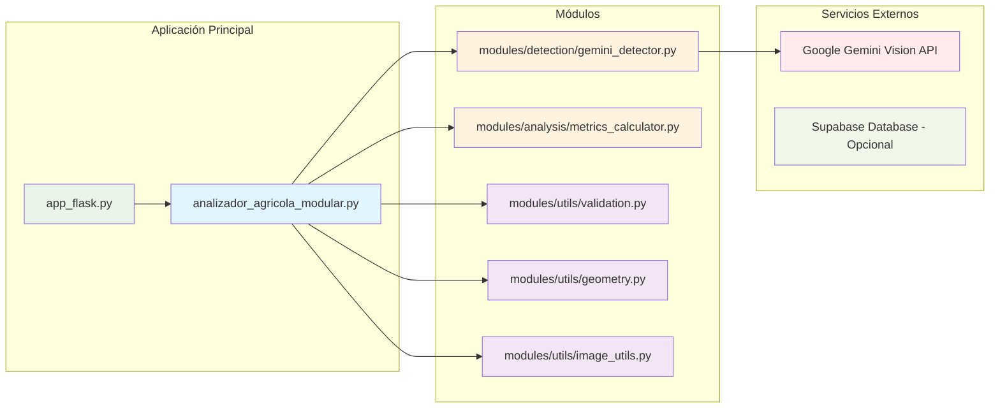
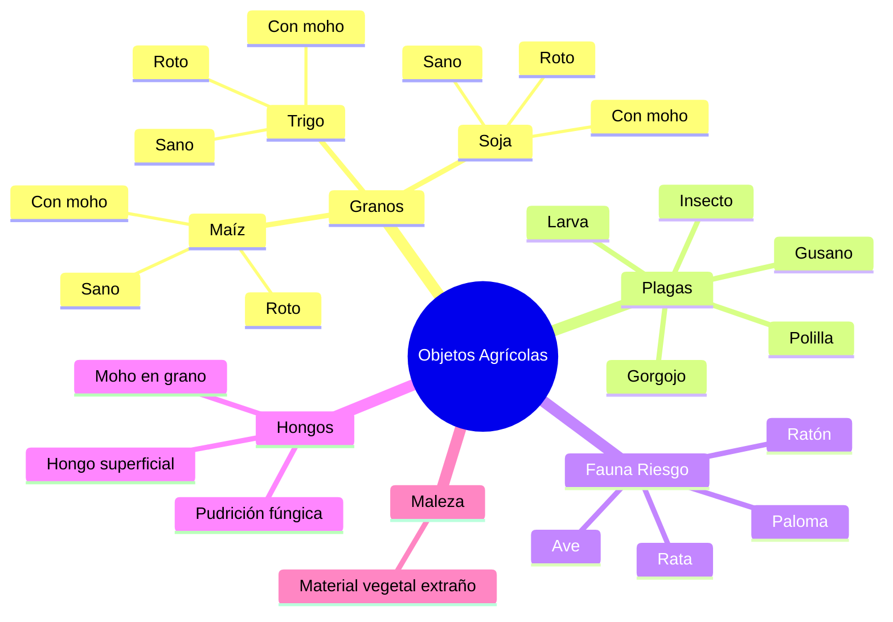
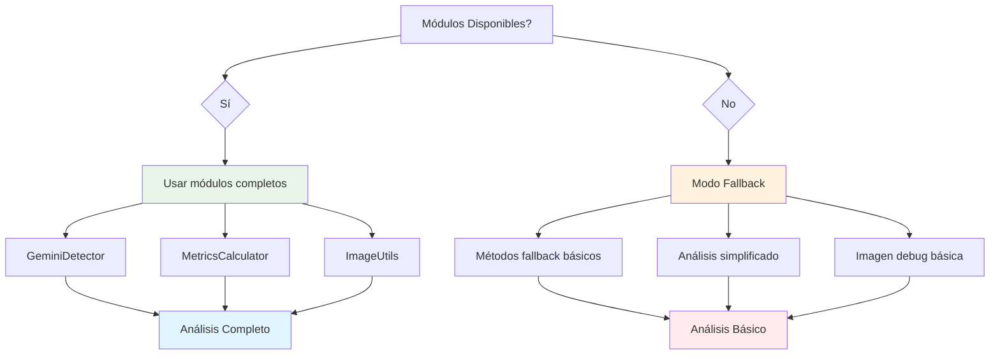
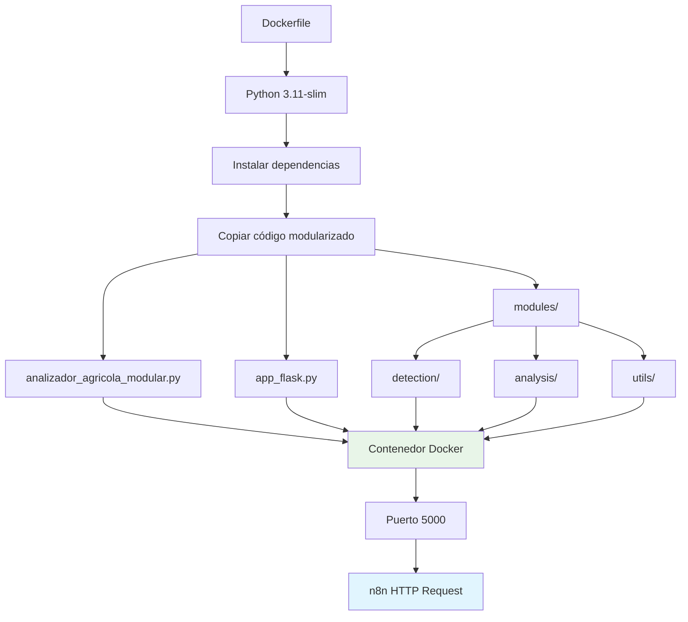
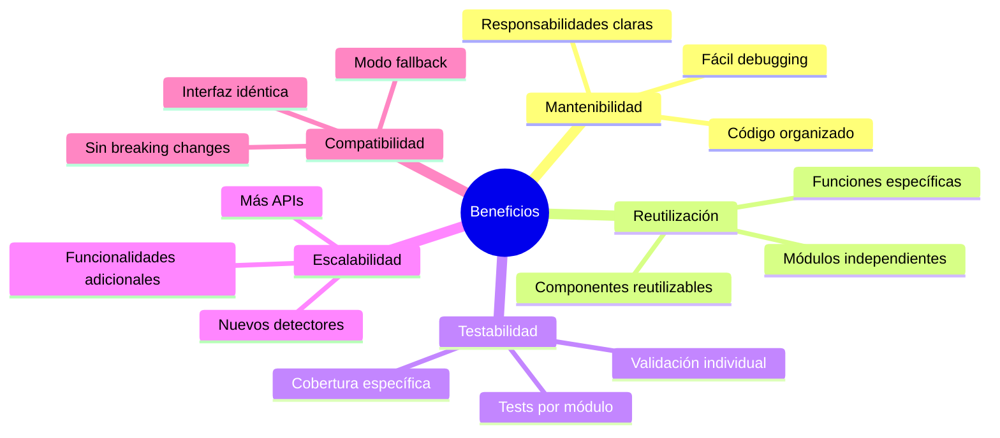

# Arquitectura del Sistema Agrícola Modularizado

## Diagrama de Flujo Principal

```mermaid
graph TD
    A[Usuario envía imagen por Telegram] --> B[n8n recibe imagen]
    B --> C[HTTP Request a Flask App]
    C --> D[app_flask.py]
    D --> E[AnalizadorAgricola.analizar_imagen()]
    
    E --> F[Procesar imagen PIL]
    F --> G[GeminiDetector.detectar_con_gemini()]
    G --> H[Gemini Vision API]
    H --> I[Detectar objetos individuales]
    
    I --> J[Filtrar por confianza + validar labels]
    J --> K[Second Pass: buscar plagas en zonas con moho]
    K --> L[Fusionar granos contiguos]
    L --> M[Generar imagen debug con bounding boxes]
    
    M --> N[Calcular métricas cuantitativas]
    N --> O[Generar diagnóstico técnico]
    O --> P[Generar diagnóstico agronómico global]
    P --> Q[Crear data_momento para agente]
    
    Q --> R[Devolver JSON completo]
    R --> S[n8n procesa respuesta]
    S --> T[Enviar resultado a Telegram]
```

## Arquitectura Modular



## Flujo de Detección de Objetos

```mermaid
flowchart TD
    A[Imagen PIL] --> B[GeminiDetector.detectar_con_gemini()]
    B --> C[Prompt especializado para agricultura]
    C --> D[Gemini Vision API]
    D --> E[Array JSON con objetos detectados]
    
    E --> F[Filtrar por confianza score >= 0.6]
    F --> G[Validar labels con firewall]
    G --> H[Clasificar: categoria, especie, estado]
    
    H --> I[Second Pass: zonas sospechosas]
    I --> J[Detectar plagas en áreas con moho]
    J --> K[Fusionar granos contiguos]
    K --> L[Non-Max Suppression por label]
    
    L --> M[Lista final de objetos detectados]
    
    style A fill:#e3f2fd
    style D fill:#ffebee
    style M fill:#e8f5e8
```

## Tipos de Objetos Detectados



## Métricas y Diagnósticos

```mermaid
graph TD
    A[Objetos Detectados] --> B[calcular_metricas()]
    
    B --> C[Contar por categoría]
    B --> D[Contar por especie]
    B --> E[Calcular % grano con moho]
    B --> F[Evaluar riesgos]
    
    C --> G[Métricas Cuantitativas]
    D --> G
    E --> G
    F --> G
    
    G --> H[armar_diagnostico()]
    G --> I[armar_data_momento()]
    
    H --> J[Diagnóstico Técnico]
    I --> K[Data para Agente RAG]
    
    J --> L[Recomendaciones de Acción]
    K --> M[Hallazgos Clave]
    
    style G fill:#e8f5e8
    style J fill:#fff3e0
    style K fill:#e1f5fe
```

## Respuesta JSON Completa

```mermaid
graph LR
    A[analizar_imagen()] --> B[JSON Response]
    
    B --> C[timestamp]
    B --> D[tipo_imagen]
    B --> E[objetos_detectados]
    B --> F[metricas]
    B --> G[diagnostico_texto]
    B --> H[diagnostico_global]
    B --> I[data_momento]
    B --> J[imagen_bbox_path]
    
    E --> K[Lista de objetos con bbox]
    F --> L[Conteos y porcentajes]
    G --> M[Riesgo sanitario/comercial]
    H --> N[Explicación agronómica]
    I --> O[Estructura para RAG]
    J --> P[Ruta imagen debug]
    
    style B fill:#e8f5e8
    style K fill:#fff3e0
    style L fill:#fff3e0
    style M fill:#ffebee
    style N fill:#e1f5fe
    style O fill:#f3e5f5
    style P fill:#e8f5e8
```

## Modo Fallback



## Docker y Despliegue



## Ventajas de la Modularización


